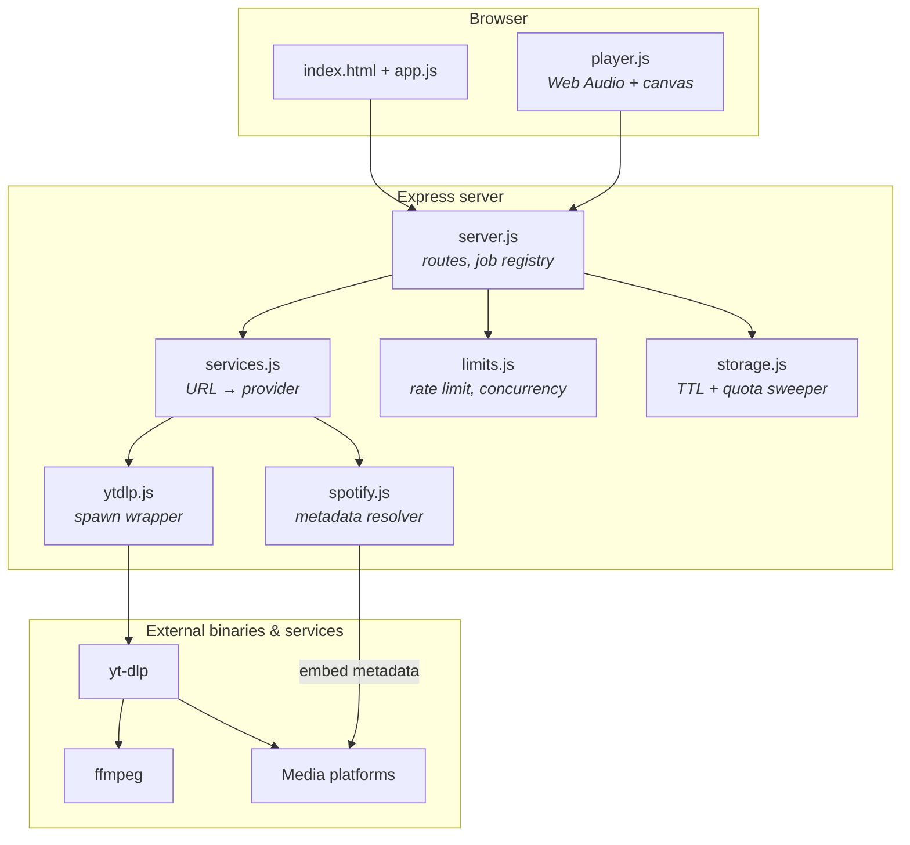
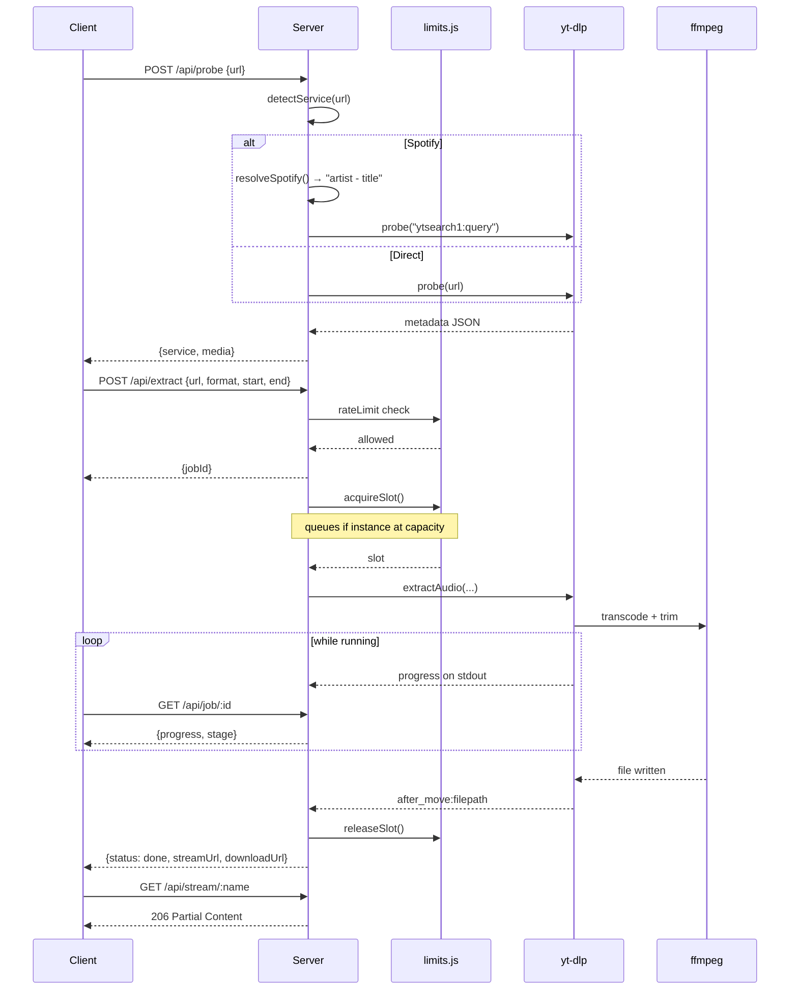
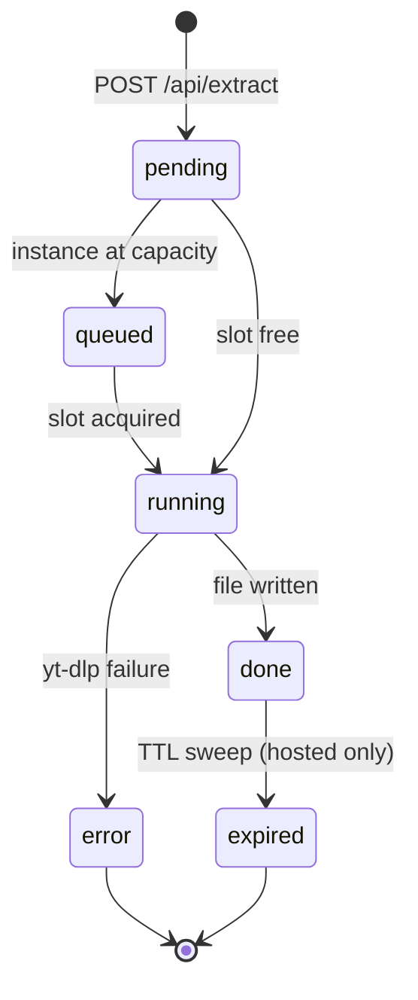
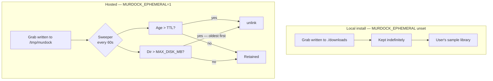
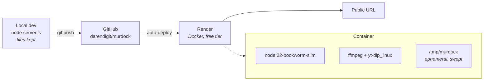

# murdock — Engineering Scope & Delivery

> **Repo:** `darendigit/murdock` · **Runtime:** Node 20+ · **Last updated:** 2026-07-20
>
> Diagrams are Mermaid. In Notion, paste into a code block and set the language
> to *Mermaid*, then switch the block to **Preview** to render.

---

## 1. Architecture

murdock is a small Express server wrapping two binaries. The binaries do the
real work; the application code is orchestration, safety, and presentation.



### Module responsibilities

| Module | Responsibility | Key constraint |
| --- | --- | --- |
| `server.js` | HTTP routes, job registry, request validation | Jobs are in-memory; files on disk are the artifact |
| `src/services.js` | Map a URL to a provider and extraction mode | Unknown hosts fall through to `direct`, not rejected |
| `src/ytdlp.js` | Spawn yt-dlp, parse progress, resolve output path | **Never uses a shell** — argv array only |
| `src/spotify.js` | Resolve a Spotify track to a searchable query | No API key; reads the embed page payload |
| `src/storage.js` | TTL sweep, disk quota eviction | Opt-in via `MURDOCK_EPHEMERAL` |
| `src/limits.js` | Per-IP rate limits, global job concurrency | In-memory; single instance only |
| `public/player.js` | Waveform decode, transport, seek | Zero dependencies |

---

## 2. Request lifecycle

Extraction is asynchronous. `POST /api/extract` returns immediately with a job
id and the client polls — necessary because a long grab far outlives any
reasonable HTTP timeout.



### Job state machine



---

## 3. Storage model

This is the part with the sharpest edge, and it is deliberately asymmetric
between local and hosted.



### Two independent limits

| Limit | Env var | Default | Behaviour |
| --- | --- | --- | --- |
| Age | `MURDOCK_TTL_MINUTES` | 30 | Files older than TTL are unlinked |
| Size | `MURDOCK_MAX_DISK_MB` | 400 | Oldest evicted until the directory fits |

Whichever trips first wins. The size cap exists because without it a few long
WAV grabs fill a small host's disk and every later job fails with an opaque
write error.

### Why auto-delete is opt-in

> **Incident, 2026-07-20.** The sweeper originally defaulted to *on*. Enabling
> it pointed a 30-minute TTL at a local `downloads/` folder holding the user's
> real working files and deleted two of them. `fs.unlink` does not use the
> Trash, so the deletion was unrecoverable.

The root cause was treating one directory as two different things. On a hosted
instance the download directory is a scratch buffer and sweeping is required.
On a local install it *is* the user's library, and sweeping destroys their work.

The fix inverts the default: `startSweeper()` is a no-op unless
`MURDOCK_EPHEMERAL=1`, which only the container sets. The server also refuses to
advertise an expiry countdown when sweeping is off, so the UI can never promise
a deletion that will not happen.

**Design rule taken from this:** destructive defaults must be opt-in, and any
sweeper must be pointed at a directory it exclusively owns.

---

## 4. Data model

Jobs live in an in-memory `Map`, deliberately. They are cheap to reconstruct
(re-run the grab) and a restart clears the buffer anyway.

```js
{
  id: "uuid",
  status: "pending" | "running" | "done" | "error",
  service: "youtube",
  progress: 0-100,
  stage: "Downloading" | "Converting to WAV" | "Queued — instance busy" | "Ready",
  createdAt: 1784511350679,

  // populated on success
  filename:    "Title [id]_60-85.wav",
  sizeBytes:   1921102,
  downloadUrl: "/api/file/...",
  streamUrl:   "/api/stream/...",
  expiresAt:   1784513150679,   // hosted only
  error:       "…"              // on failure
}
```

### File naming

```
Big_Buck_Bunny [YE7VzlLtp-4]_60-85.wav
└── title ──┘ └── source id ┘└clip┘└fmt┘
```

The clip range is part of the name. Without it, two different sections of the
same source collide and the second grab silently returns the first one's audio.

---

## 5. API

| Endpoint | Method | Purpose | Limit |
| --- | --- | --- | --- |
| `/api/health` | GET | yt-dlp status, storage stats, active jobs, limits | — |
| `/api/probe` | POST | Identify service + metadata, no download | 60/hr per IP |
| `/api/extract` | POST | Start a job → `{jobId}` | 12/hr per IP |
| `/api/job/:id` | GET | Poll status, progress, URLs | — |
| `/api/stream/:name` | GET | Inline audio, Range-capable, for the player | — |
| `/api/file/:name` | GET | `Content-Disposition: attachment` download | — |

Stream and download are separate endpoints on purpose: the download route
forces an attachment, which suppresses inline playback and defeats seeking. The
stream route serves inline and honours `Range`, returning `206 Partial Content`.

### Security posture

| Risk | Mitigation |
| --- | --- |
| Shell injection via pasted URL | `spawn` with an argv array, `shell: false`. Never `exec`. |
| Path traversal on file routes | `basename()` then verify the resolved parent is the download dir |
| Resource exhaustion | Per-IP rate limits + global concurrency semaphore |
| Disk exhaustion | Quota eviction, oldest first |
| Oversized request bodies | `express.json({ limit: '64kb' })` |

---

## 6. Deployment



### Free-tier characteristics

| Property | Value | Consequence |
| --- | --- | --- |
| RAM | 512 MB | `MAX_CONCURRENT=2`; parallel WAV transcodes are the risk |
| Disk | Ephemeral | Wiped on restart/redeploy — suits the TTL model |
| Idle | Sleeps after ~15 min | First request after idle takes ~1 min to cold-start |
| Cost | $0 | No card required |

### Known deployment risk

YouTube blocks datacenter IPs. Expect *"Sign in to confirm you're not a bot"*
from Render for YouTube specifically. Other providers are far less aggressive.
There is no clean fix — cookie injection and residential proxies both work but
are fragile and carry account-ban risk, so neither is implemented.

**This is the single most likely reason the hosted instance disappoints
relative to local.** Plan around it rather than expecting parity.

---

## 7. Delivery status

| # | Item | Status | Verification |
| --- | --- | --- | --- |
| 1 | Service detection | ✅ Done | Probe returns correct provider for all 12 |
| 2 | Audio extraction | ✅ Done | `ffprobe` confirms codec, rate, channels |
| 3 | Clip trimming | ✅ Done | 10s request → 10.005s output |
| 4 | Stereo downmix | ✅ Done | 5.1 source → 2ch verified |
| 5 | Spotify resolver | ✅ Done | Resolves artist + correct YouTube match |
| 6 | Waveform player | ✅ Done | Playback, seek to 75% → 0:18/0:25 |
| 7 | TTL + quota sweep | ✅ Done | Both limits unit-tested against fixtures |
| 8 | Rate limit + concurrency | ✅ Done | 429 after limit; semaphore verified |
| 9 | Dockerfile + render.yaml | ⚠️ Untested | **No Docker locally — build unverified** |
| 10 | Public deployment | ⬜ Pending | Requires Render account connect |

### Bugs found and fixed during build

| Bug | Symptom | Cause |
| --- | --- | --- |
| 5.1 passthrough | 6-channel WAV, awkward in a DAW | yt-dlp preserved surround; no downmix |
| Spotify artist wrong | Artist reported as "Spotify" | Track page is an SPA with no OG tags |
| Search container | Title = query, null duration | `ytsearch1:` returns a playlist wrapper |
| Re-grab failure | "produced no audio file" | yt-dlp skipped existing file; dir-diff found nothing |
| Clip collision | Second clip returned first clip's audio | Filename omitted the clip range |
| Progress stuck at 0 | Bar jumped 0 → 100 | Read from stderr; `--print` implies `--quiet` |
| **Data loss** | Two user files deleted | Sweeper defaulted on against a real library |

### Open risks

1. **Docker build unverified.** Base image and yt-dlp binary URL both confirmed
   reachable, but the image has never been built. First Render deploy is the
   real test.
2. **YouTube on cloud IPs.** See above.
3. **Public exposure.** An open endpoint on a personal hosting account carries
   DMCA and termination risk. Rate limits reduce abuse but do not remove it.
4. **In-memory state.** Rate limits and jobs reset on restart, and would be
   wrong across multiple instances. Fine at one instance; needs Redis beyond.
