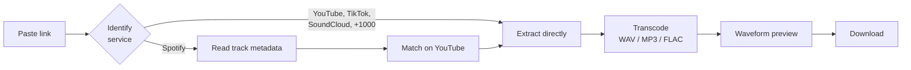

# murdock — Product Scope & Plan

> **Status:** v0.1 shipped and working locally · Public deployment in progress
> **Owner:** darendigit
> **Last updated:** 2026-07-20

---

## 1. Problem

Sourcing vocal stems and samples from online media is a chore. The current
workflow means hunting for a working ripper site, wading through ad walls and
fake download buttons, accepting whatever bitrate you're given, then trimming
the clip by hand in a DAW. Every one of those sites is unreliable, and the ones
that work this month are broken the next.

The work is repetitive and mechanical, which makes it a tooling problem.

## 2. What murdock is

A single-purpose tool: **paste a link, get an audio file.**

It identifies which service a URL belongs to, extracts the audio, transcodes it
to a chosen format, and hands back a file — with an inline waveform preview so
you can hear the grab before committing to it.

### Who it's for

One user: a DJ and producer building tracks from sampled vocals. Every design
decision resolves in favour of that workflow rather than a general audience.
Concretely, that means lossless formats are first-class, clip trimming matters
more than playlist support, and stereo output is the default because that's
what loads cleanly into a DAW.

### Non-goals

| Not doing | Why |
| --- | --- |
| A general media downloader | Video, subtitles, and playlists are scope creep. Audio only. |
| A DAW or editor | Trim on the way out; real editing happens downstream. |
| A music library / catalogue | Files leave the tool and live in the user's own storage. |
| Defeating DRM | Spotify and Apple Music streams are encrypted. Out of scope, permanently. |
| A commercial service | Personal tool. No accounts, no billing, no growth targets. |

---

## 3. How it works

### The user journey

1. **Paste** a URL from YouTube, TikTok, Instagram, X, SoundCloud, Bandcamp,
   Spotify, or roughly a thousand other sites.
2. **Choose** an output format. WAV and FLAC are lossless and the right pick for
   sampling; MP3 is there for convenience.
3. **Optionally trim** with start/end timecodes, so you pull the one phrase you
   want instead of a ten-minute file.
4. **Preview** on the waveform. Scrub, seek, confirm it's the right take.
5. **Download.**

### Why the preview matters

It's the step that saves the most time. Without it, checking a grab means
downloading, opening a DAW, importing, and listening — then discarding it and
starting over if the match was wrong. The waveform also shows *where* the vocal
sits, which feeds directly back into the trim fields.

---

## 4. Shipped in v0.1

| Capability | Detail |
| --- | --- |
| Service detection | 12 named platforms, with unknown hosts attempted rather than rejected |
| Audio extraction | WAV, FLAC, MP3, M4A, OPUS |
| Clip trimming | Start/end as `0:45`, `1:02:03`, or raw seconds; accurate to ~5ms |
| Waveform preview | Click/drag seek, keyboard scrub, play/pause |
| Stereo downmix | On by default; 5.1 sources otherwise load awkwardly into a DAW |
| Spotify resolution | Metadata lookup → YouTube match (see constraints) |
| Progress reporting | Live percentage during download and transcode |

---

## 5. Constraints worth knowing

These are properties of the problem, not bugs to be fixed later.

### Spotify cannot be downloaded

Spotify streams are Widevine-DRM encrypted. No tool can extract them — not
murdock, not yt-dlp, not any paid service claiming otherwise. murdock reads the
track's public metadata and matches it against YouTube instead.

**Consequence:** the match is a best guess. You may get a live version, a
remaster, or a cover rather than the album cut. The UI always shows what it
matched so you can check before sampling.

### Hosted instances get blocked by YouTube

YouTube actively blocks datacenter IP ranges. The same grab that works from a
home connection often fails on a cloud host with *"Sign in to confirm you're not
a bot."* This is the primary reliability risk for the deployed version.

**Consequence:** expect the hosted instance to be less reliable than local,
specifically for YouTube. SoundCloud, Bandcamp, and direct links are far less
aggressive. Mitigations (cookie injection, residential proxies) are fragile and
carry account risk; none are planned.

### yt-dlp breaks when platforms change

Extraction depends on yt-dlp, which is in a permanent cat-and-mouse game with
every platform it supports. Breakage is routine and fixed upstream quickly.

**Consequence:** `brew upgrade yt-dlp` locally, or redeploy to pick up a fresh
binary. This is the tool's main ongoing maintenance cost.

### Rights are not cleared by downloading

Grabbing a file confers no licence. Sampling law has no de minimis safe harbour
you can rely on — anything that ends up in a release is a clearance
conversation with the rights holder. The tool is built for personal,
non-commercial use.

---

## 6. Roadmap

### Next

- **Waveform-driven trimming** — click the waveform to set start/end instead of
  typing timecodes. Small addition on top of what exists; removes the last
  manual step in the core loop.
- **Stem separation** — run Demucs to split vocals from instrumental. This is
  the feature that takes murdock from *"grab the audio"* to *"grab the vocal,"*
  which is the actual job. Biggest single jump in usefulness.

### Later

- **Batch queue** — paste several links, walk away.
- **Session history** — recent grabs, re-download without re-extracting.
- **Loop preview** — audition a clip on repeat, the way you'd hear it in a track.
- **Format presets** — one-click "sampling" (WAV/stereo) vs "reference" (MP3).

### Explicitly deferred

Accounts, sharing, playlists, and mobile apps. None serve a single-user tool.

---

## 7. Success criteria

v0.1 succeeds if a grab-to-download cycle takes **under 30 seconds** and the
result drops into a DAW without further conversion.

Longer term, the measure is whether it replaces the ripper-site habit entirely.
